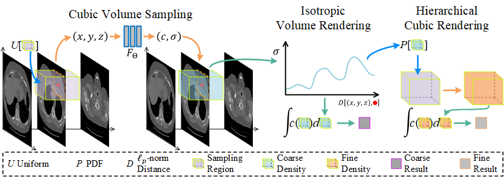

# Vol-NeRF: An Unbounded Representation for Medical Volume Data
## CVPR 2023 Submission #3358 

## Arbitrary Views
* axis $\overset{\rightarrow}{n}=(1, 0, 0)$

<table rules="none" align="center">
	<tr>
		<td>
			

<<<<<<< HEAD
<<<<<<< HEAD
  				
=======
				<video width="100%" controls>
  					<source src="imgs/nerf/kits_00000_axis010.mp4" type="video/mp4">
				</video>
>>>>>>> b6762efcfe2a37fc49c20de8be2b87f4093af279
=======
  				
>>>>>>> bb68c24c567edd6e762bb1bdba4c1ba4ab3d9de9
				 
				NeRF
			

		</td>
		<td>
			

<<<<<<< HEAD
<<<<<<< HEAD
=======
>>>>>>> bb68c24c567edd6e762bb1bdba4c1ba4ab3d9de9
				
				 
				<em>Vol-NeRF</em> (Ours)
			

		</td>
	</tr>
</table>

* axis $\overset{\rightarrow}{n}=(0, 1, 0)$

<table rules="none" align="center">
	<tr>
		<td>
			

  				
				 
				NeRF
			

		</td>
		<td>
			

				
<<<<<<< HEAD
=======
				<video width="100%" controls>
  					<source src="imgs/volnerf/kits_00000_axis010.mp4" type="video/mp4">
				</video>
>>>>>>> b6762efcfe2a37fc49c20de8be2b87f4093af279
=======
>>>>>>> bb68c24c567edd6e762bb1bdba4c1ba4ab3d9de9
				 
				<em>Vol-NeRF</em> (Ours)
			

		</td>
	</tr>
</table>

* axis $\overset{\rightarrow}{n}=(\frac{\sqrt{2}}{2}, \frac{\sqrt{2}}{2}, 0)$

<<<<<<< HEAD
<<<<<<< HEAD
<table rules="none" align="center">
=======
<!-- <table rules="none" align="center">
>>>>>>> b6762efcfe2a37fc49c20de8be2b87f4093af279
=======
<table rules="none" align="center">
>>>>>>> bb68c24c567edd6e762bb1bdba4c1ba4ab3d9de9
	<tr>
		<td>
			

  				
				 
				NeRF
			

		</td>
		<td>
			

				
				 
				<em>Vol-NeRF</em> (Ours)
			

		</td>
	</tr>
<<<<<<< HEAD
<<<<<<< HEAD
=======
>>>>>>> bb68c24c567edd6e762bb1bdba4c1ba4ab3d9de9
</table>

<table rules="none" align="center">
	<tr>
		<td>
			

  				
				 
				NeRF
			

		</td>
		<td>
			

				
				 
				<em>Vol-NeRF</em> (Ours)
			

		</td>
	</tr>
</table>

<table rules="none" align="center">
	<tr>
		<td>
			

  				
				 
				NeRF
			

		</td>
		<td>
			

				
				 
				<em>Vol-NeRF</em> (Ours)
			

		</td>
	</tr>
</table>
<<<<<<< HEAD
=======
</table> -->
>>>>>>> b6762efcfe2a37fc49c20de8be2b87f4093af279
=======
>>>>>>> bb68c24c567edd6e762bb1bdba4c1ba4ab3d9de9

* axis $\overset{\rightarrow}{n}=(\frac{\sqrt{2}}{2}, 0, \frac{\sqrt{2}}{2})$

<table rules="none" align="center">
	<tr>
		<td>
			

  				
				 
				NeRF
			

		</td>
		<td>
			

				
				 
				<em>Vol-NeRF</em> (Ours)
			

		</td>
	</tr>
</table>

* axis $\overset{\rightarrow}{n}=(0, \frac{\sqrt{2}}{2}, \frac{\sqrt{2}}{2})$

<table rules="none" align="center">
	<tr>
		<td>
			

  				
				 
				NeRF
			

		</td>
		<td>
			

				
				 
				<em>Vol-NeRF</em> (Ours)
			

		</td>
	</tr>
</table>

<table rules="none" align="center">
	<tr>
		<td>
			

  				
				 
				NeRF
			

		</td>
		<td>
			

				
				 
				<em>Vol-NeRF</em> (Ours)
			

		</td>
	</tr>
</table>

* axis $\overset{\rightarrow}{n}=(\frac{\sqrt{3}}{3}, \frac{\sqrt{3}}{3}, \frac{\sqrt{3}}{3})$

<table rules="none" align="center">
<<<<<<< HEAD
	<tr>
		<td>
			

  				
				 
				NeRF
			

		</td>
		<td>
			

				
				 
				<em>Vol-NeRF</em> (Ours)
			

		</td>
	</tr>
</table>

<table rules="none" align="center">
	<tr>
		<td>
			

  				
				 
				NeRF
			

		</td>
		<td>
			

				
				 
				<em>Vol-NeRF</em> (Ours)
			

		</td>
	</tr>
</table>

## Arbitrary scales
<<<<<<< HEAD

=======
<!-- <table rules="none" align="center">
=======
>>>>>>> bb68c24c567edd6e762bb1bdba4c1ba4ab3d9de9
	<tr>
		<td>
			

  				
				 
				NeRF
			

		</td>
		<td>
			

				
				 
				<em>Vol-NeRF</em> (Ours)
			

		</td>
	</tr>
<<<<<<< HEAD
</table> -->
>>>>>>> b6762efcfe2a37fc49c20de8be2b87f4093af279
=======
</table>

<table rules="none" align="center">
	<tr>
		<td>
			

  				
				 
				NeRF
			

		</td>
		<td>
			

				
				 
				<em>Vol-NeRF</em> (Ours)
			

		</td>
	</tr>
</table>

## Arbitrary scales

>>>>>>> bb68c24c567edd6e762bb1bdba4c1ba4ab3d9de9
